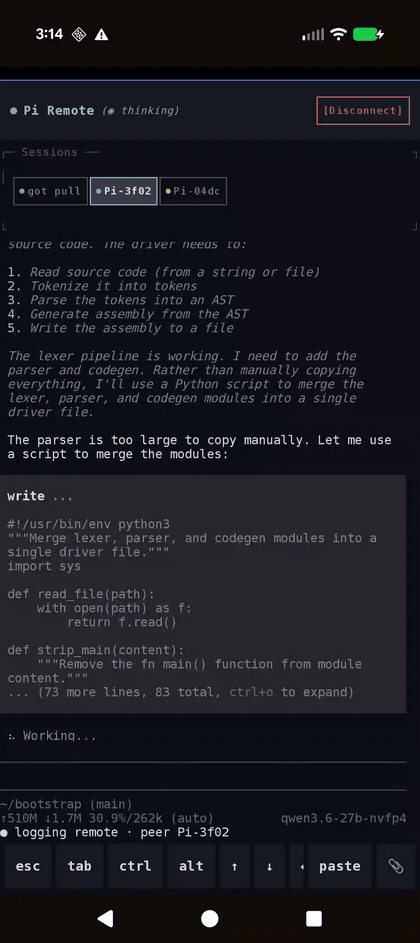

# pi-remote-control

A [pi](https://github.com/earendil-works/pi) extension that mirrors your live
pi session to your phone and lets you drive it from there. The extension
starts a TLS WebSocket server inside pi (no separate process), prints a QR
code, and streams the actual terminal UI — everything that renders in your
terminal renders on the phone, re-wrapped to the phone's width. Keystrokes
from the phone go back through pi's own input path, so menus, pickers, and
slash commands all just work.

The reference client is the Android app at
[`kolt-mcb/pi-remote-control-app`](https://github.com/kolt-mcb/pi-remote-control-app);
the protocol is plain WS + JSON, so anything that can speak it works.

Runs on **stock upstream pi** — no fork, no patches.

<p align="center">
  
</p>

LAN-only by design — no cloud relay, no telemetry, no third-party SDKs. The
phone (or other client) talks directly to your pi over `wss://` with a
self-signed cert that's [pinned by SHA-256 fingerprint](#security-notes) in
the QR, and a [shared-secret token](#auth) gates every connection on top.

| | |
|---|---|
| **Status** | Early. Solo-author project. APIs and storage formats may change between commits. |
| **License** | MIT — see [LICENSE](LICENSE). |
| **Privacy** | No analytics, no remote logging, no SDK callbacks. Network traffic is exactly: the pi WS server the client connects to, end-to-end TLS-encrypted with a pinned self-signed cert. |

## Features

- **Full-screen TTY mirror** — the phone shows pi's real TUI, rendered
  server-side at the phone's column width. Frames are row-diffed and
  deflate-compressed, so steady-state traffic is ~1 KB/s and the mirror stays
  responsive over slow links (tested at 30 KB/s).
- **Type from the phone** — a terminal keyboard on the client injects
  keystrokes into pi's input path. Slash commands open pi's own menus in the
  mirror.
- **Multi-session** — start a second pi on the same machine and it joins the
  first as a peer over the same port; connected clients can view and drive
  every session and spawn new ones in a chosen directory.
- **History replay** — on connect the client receives the whole conversation
  so far, not just events from that point on.
- **File and image delivery** — two agent tools are registered:
  `send_file_to_phone` pushes a file to connected clients, and
  `show_image_to_phone` displays an image inline in the mirror (the phone can
  render images even when the host terminal can't).
- **Theme mirroring** — the client is told pi's active theme palette so
  colors match.

## Install

Pi installs the extension from this repo's git URL:

```bash
pi install git:github.com/kolt-mcb/pi-remote-control
```

After that, every `pi` launch loads the extension automatically. The WS
server starts on `session_start` and prints its URL + a QR code:

```
┌─ Pi Remote Control (host) ───────────────────────────────────────────┐
│  wss://192.168.1.42:8765/?token=…32hex…&fp=…64hex…                   │
└──────────────────────────────────────────────────────────────────────┘
  auth: shared-secret token from /home/you/.pi/agent/pi-remote-control.token
  tls:  /home/you/.pi/agent/pi-remote-control.crt
  fingerprint: sha256:abcd1234…ef905678 (full value pinned in the QR)
█▀▀▀▀▀█  ▄ █ ▄▄ █▀▀▀▀▀█
█ ███ █ ▀ ▄▀█ ▄ █ ███ █
[ ... QR code ... ]
```

You can also re-display the QR code anytime with `/remote-qr`, and stop the
server with `/remote-stop`.

Update later:
```bash
pi update git:github.com/kolt-mcb/pi-remote-control
```

Then restart pi.

## Phone client

Side-load the Android app from its
[Releases](https://github.com/kolt-mcb/pi-remote-control-app/releases) and
scan the QR the extension prints. Setup details, features, and build
instructions live in the
[`pi-remote-control-app`](https://github.com/kolt-mcb/pi-remote-control-app)
repo. The connect screen also lets you paste the WS URL manually if you can
read it off the host.

## Configuration

All configuration is via environment variables on the host:

| variable | default | effect |
|---|---|---|
| `PI_REMOTE_PORT` | `8765` | Port the WS server listens on. A second pi finding the port busy joins as a peer instead. |
| `PI_REMOTE_TOKEN` | — | Provide your own auth token (e.g. from a password manager). Wins over the persisted file. |
| `PI_REMOTE_CONTROL_NO_AUTH` | — | `1` disables token auth entirely. **Only safe on networks you fully trust.** The startup banner prints a loud warning. |
| `PI_REMOTE_CONTROL_NO_AUTOSTART` | — | `1` stops the server from starting on `session_start`; run `/remote-control` manually instead. |
| `PI_REMOTE_WIDTH_CACHE` | — | `1` enables a width-keyed render cache patch on pi-tui's Text/Markdown components. The mirror renders every frame a second time at the phone's width; without the cache the two widths evict each other's single cache slot on every alternation. Measured ~2× on render cost for long sessions. |
| `PI_REMOTE_DEBUG` | — | `1` prints per-second mirror render/throughput counters. |

## Auth

The WS server requires a shared-secret token. On first launch, the extension
generates one and persists it to `~/.pi/agent/pi-remote-control.token`
(mode 0600). Subsequent launches reuse it, so a QR your phone scanned today
keeps working tomorrow.

The token is included in the printed URL/QR alongside the cert fingerprint
(see [Security notes](#security-notes) for what `fp` is doing):
```
wss://your-host:8765/?token=<32 hex chars>&fp=<64 hex chars sha256>
```
Connections without a matching `?token=…` are closed with WS code `4001`.

To rotate the token: delete `~/.pi/agent/pi-remote-control.token` and
restart pi. A fresh one will be generated and previous QRs/URLs become
invalid.

## Security notes

- **Transport is TLS by default — pinned, not CA-trusted.** The extension
  mints a self-signed 2048-bit RSA cert on first launch and persists it at
  `~/.pi/agent/pi-remote-control.{crt,key}` (mode 0600); the WS server runs
  as `wss://`. The cert's SHA-256 fingerprint is embedded in the printed URL
  and QR (`?fp=<64 hex chars>`), and the client pins it on scan. Any cert
  whose fingerprint doesn't match is rejected — so even a same-LAN attacker
  who can sniff packets sees only opaque TLS records, and a MITM with a
  stolen IP can't substitute their own cert (no CA-trust chain to subvert).
  Token auth still gates connection on top.
- **Rotating the cert.** Delete both `pi-remote-control.crt` and
  `pi-remote-control.key` from `~/.pi/agent/` and restart pi. A fresh cert is
  generated; the next QR carries the new fingerprint and previously-scanned
  clients need to scan again. Same shape as token rotation.
- The WS server binds `0.0.0.0` because that's required for the phone to
  reach it from another LAN host. If your machine has multiple interfaces
  (including a hostile one like a coffee-shop wifi), it'll listen on all of
  them. The fingerprint pin still protects the channel, but the port is
  publicly reachable on whatever interfaces are up.
- WAN access isn't built in. To drive pi over the internet, put it behind
  Tailscale / WireGuard / an SSH tunnel — the existing TLS + token still
  apply inside the tunnel.
- The extension is the only attack surface on the host side. There's no
  daemon outside pi's process; killing pi takes the server down.
- Remember that anyone holding the QR (token + fingerprint) can drive your
  coding agent, which can run shell commands. Treat the QR like a password.

## Build from source

```bash
git clone https://github.com/kolt-mcb/pi-remote-control
cd pi-remote-control
npm install
# Run pi with the extension loaded directly (won't survive pi restarts):
pi -e ./extension.ts
# Or `pi install` it once, then plain `pi`.
```

## Protocol

Plain JSON over WS; frames larger than 512 B are sent zlib-deflated as binary
messages when the client opts in. If you want to write your own client, the
authoritative reference is `extension.ts` — search for `handleHostCmd`
(client→host) and the `send`/`bcast` helpers (host→client). Key shapes:

| client → host | meaning |
|---|---|
| `{type:"client_hello", mirrorOnly?, diff?, deflate?, mirrorImages?}` | capability handshake; send first |
| `{type:"mirror", on, agentId?}` | subscribe/unsubscribe to the screen mirror (optionally of a peer session) |
| `{type:"mirror_input", data, agentId?}` | inject raw keystrokes into the mirrored session |
| `{type:"viewport", cols}` | tell the host the client's column width; mirror frames re-render to fit |
| `{type:"prompt" / "steer" / "follow_up", message, images?, targetAgentId?}` | send a user message / interrupt / queued follow-up |
| `{type:"slash_command", command, args?, targetAgentId?}` | run a `/command` |
| `{type:"spawn_peer", sessionPath?, cwd?}` | spawn a new pi as a peer session (optionally resuming a saved session) |
| `{type:"get_sessions"}` / `{type:"get_saved_sessions"}` | request the connected-agent / saved-session lists |
| `{type:"list_host_dirs", path?}` | browse host directories (for the spawn-peer folder picker) |
| `{type:"input", id, value}` / `{type:"extension_ui_response", id, value?, cancelled?}` | answer a render-frame menu or dialog |

| host → client | meaning |
|---|---|
| `{type:"connected", agentId, ...}` | handshake result; identifies the host session |
| `{type:"mirror_frame", agentId, seq, lines, cursor, width, height}` | full mirror keyframe (ANSI lines) |
| `{type:"mirror_diff", agentId, seq, lineCount, rows:[{i,t}], cursor}` | row-level diff against the previous frame |
| `{type:"history", messages}` | conversation replay on connect |
| `{type:"agent_start"/"agent_end"/"turn_start"/"turn_end", agentId}` | turn lifecycle |
| `{type:"message_*" / "tool_*", agentId, ...}` | per-message / per-tool streaming events |
| `{type:"session_list"}` / `{type:"saved_sessions"}` | session inventories |
| `{type:"file", name, mimeType, data, agentId?}` | file pushed by `send_file_to_phone` (agentId set when it came from a peer session) |
| `{type:"render", id, lines, inputMode, ...}` | ANSI render frame for an in-extension menu |
| `{type:"extension_ui_request", method, id, ...}` | dialogs/notifications (`select`, `notify`, …) |
| `{type:"theme_info", theme}` | pi's active theme palette |

## Contributing

Issues and PRs welcome. This is hobby-scale software; expect the code to be
opinionated about pi's specific conventions and to lag behind upstream pi
changes by a few days.

## Acknowledgements

- [pi](https://github.com/earendil-works/pi) by Mario Zechner — the CLI
  coding agent this extension hooks into, whose extension API makes all of
  this possible without patching.
